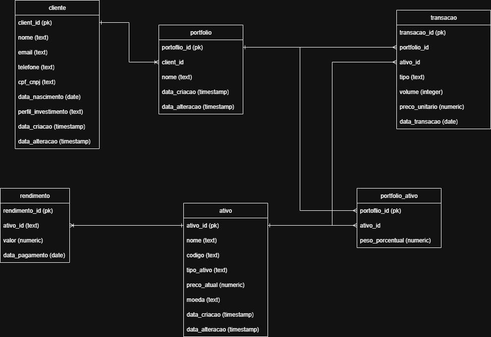
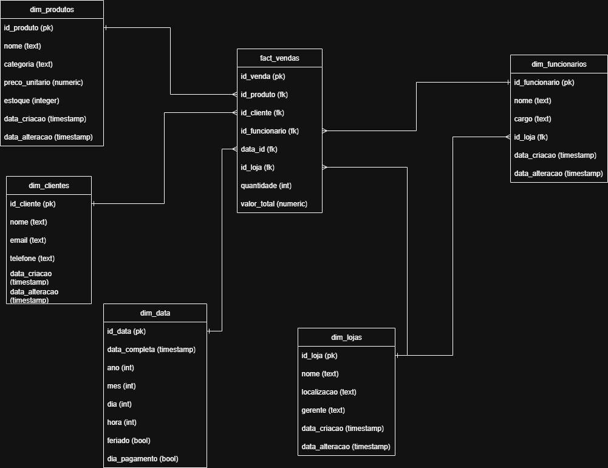
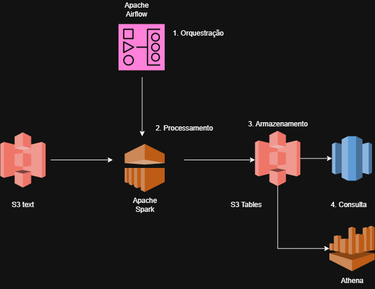
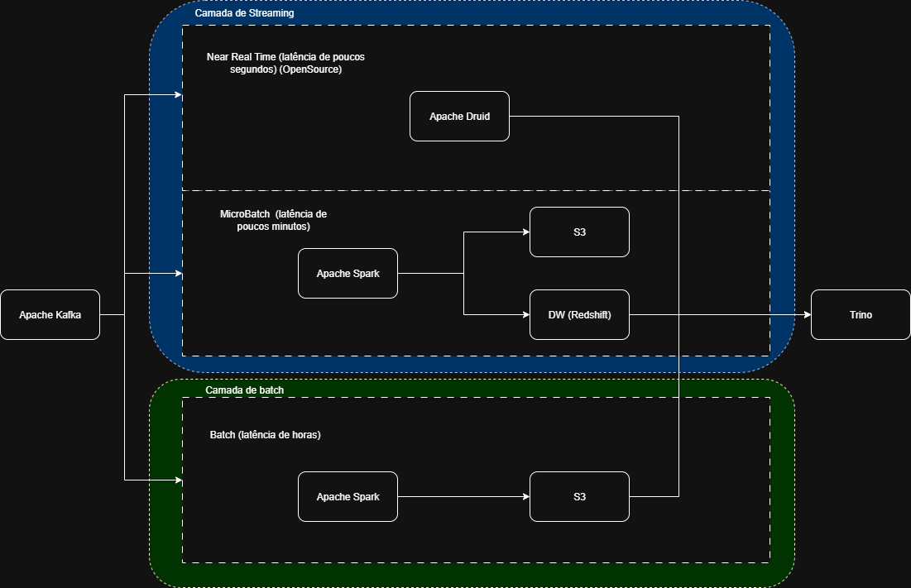

## Questão 1

Relacionado a alta frequencia e leitura existe a necessidade de uma base de replica focada em leitura.
Se existir problemas relacionado a latência (aplicações que necessitam de informações atualizadas rapidamente) será necessário
uma arquitetura multi region. Soluções Cloud conseguem nos ajudar com isso. Caso seja apenas queries consultivas para usuários físicos
provavelmente não há necessidade por conta da latência. Mas por se tratar de um banco crítico é interessante realizar um deploy multi region
Particularmente soluções cloud auxiliam muito nessa configuração

https://aws.amazon.com/pt/blogs/database/deploy-multi-region-amazon-aurora-applications-with-a-failover-blueprint/
https://docs.aws.amazon.com/AmazonRDS/latest/AuroraUserGuide/aurora-global-database.html
https://docs.aws.amazon.com/AmazonRDS/latest/AuroraPostgreSQLReleaseNotes/AuroraPostgreSQL.Updates.html

É importante também ter monitoramentos a nível de recurso computacional, principalmente storage e CPU
Além de uma monitoria de queries que podem estar travando o base, monitorar o número de conexões ativas também é importante
E evitar usuários compartilhados, caso exista algum usuário ofensor é importante isolar o problema rapidamente e não impactar demais usuários/aplicações

Releventa manter uma rotina de backup para disaster recovery

## Questão 2

Tabela cliente: Tabela para armazenar dados referente ao cliente

Tabela porfolio: Tabela para armzenar dados referente ao porfolio, no caso um portfolio é relacioado a um cliente, sendo que 1 cliente pode ter N portfolios

Tabela transacao: Tabela para armazenar dados referentes a transações, caracterizando o tipo (compra, venda), o volume de determinado ativo naquela transação e o PU no momento da transação. Nesse caso podemos ter transações diferentes para um mesmo porfolio e ativo, caracterizando uma relação 1:N com as tabelas originais de portfolio e ativo

Tabela ativo: Tabela para armazenar dados referentes ao ativo, caracterizado o nome do ativo, código para transações, tipo, o preco atual, moeda de referência. Com chave primária o ativo_id que tem relação 1:n com as tabelas rendimento e porfolio_ativo

Tabela rendimento: Tabela para armazenar dados referentes a quanto um ativo rendeu.

Tabela portfolio_ativo: Tabela para armazenar dados referentes a composição do portfólio, com os pesos porcentuais do ativo dentro da carteira.

## Questão 3

Tabela fato:

fact_vendas: tabela fato com valores numéricos referente a vendas.

Tabelas dimensionais:

dim_funcionarios: tabela dimensional caracterizando os funcionários responsáveis pela venda.

dim_lojas: tabela dimensional caracterizando onde foi realizada a venda.

dim_produtos: tabela dimensional caracterizando os produtos, como se fosse o catálogo, podendo receber adição de mais colunas para caracterizar dimensoes, marca, etc

dim_clientes: tabela dimensional caracterizando os clientes, podendo receber mais colunas importantes importantes para analise, exemplo data de nascimento, se possui cartao de credito cadastrado, sexo, se possui algum beneficio

dim_data: tabela extra adicionada para realizar filtros de datas, especificamente no varejo pode ser relevante adicionar uma coluna extra para categorizar black friday ou eventos da própria empresa.

## Questão 4 

A arquitetura proposta segue a ideia de lakehouse, com traços de um arquitetura medallion

https://www.databricks.com/glossary/medallion-architecture

Nesse caso separamos a arquitetura em 4 pontos principais:

1. Orquestração: Responsável por disparar a cada hora o pipeline que irá ler os dados em texto. Nessa camada foi proposto o Airflow gerenciado pela AWS, mas pode ser usado uma solução mais simples, sendo apenas um CronJob com scheduler, stepfunction, que depende se irá existir a necessiade de outras integrações diferentes/regras de dependência e afins.
2) Processamento: Nessa etapa foi escolhido como framework principal o apache spark, robusto e com grande uso na comunidade de dados. Ele é capaz de realizar processamento/leitura em paralela. Tradicionalmente ele é utilizado para grandes volumes de dados e para transformações mais pesadas. Hoje estão surgindo novas ferramentas que lidam com uma quantidade de dados relativamente bem até 100gb de dados, como o duckdb.
3) Disponibilização: Nessa camada de armazenamento é proposto salvar os dados no formato de tabela Apache Iceberg, em parquet e com metadados externalizados no AWS Glue Catalog. O parquet é um formato colunar, excelente para consultas OLAP e amplamente utilizado pela comunidade. O apache iceberg é um formato de tabela que permite abstrair operações ACID em um ObjectStorage, como o S3, permitindo reorganização dos dados sem downtime. Recentemente a aws lançou um produto que permite automatizar operações com esse formato por um preço não muito mais alto que o S3 standard, ainda não indicado para produção, mas promissor.
https://aws.amazon.com/pt/blogs/aws/new-amazon-s3-tables-storage-optimized-for-analytics-workloads/
4) Consulta: Uma vez disponibilizado os metadados no AWS Glue e dados no S3 pode ser plugado o Athena como SQL Engine. Caso exista necessidade de dados mais quentes e acessados com maior frequência é possível copiar os dados para uma instância do redshift.

Pontos Cloud: Levado em consideracao que a origem é S3, então foi proposta uma arquitetura mais focada em produtos AWS. Geralmente a escolha de cloud é uma estrutura vinculada a empresa e não particularmente a àrea de dados. Mas existem possibilidades semelhantes para outras clouds, e opções mais focadas em opensource
Pontos extras Storage: Caso os dados sofressem uma rotina de expurgo do da origem, seria interessante termos apenas um storage para sincronizar os dados do ambiente externo para o nosso ambiente, sem nenhuma tratamento, puramente os arquivos. Aqui um AWS DataSync poderia ser utilizado, ou outro framework opensource
Pontos extra consulta: No mundo real pode existir a necessidade de cruzar mais bases, para essas arquiteturas mais complexas pode existir a necessidade de construir um DW, e talvez outras engines que permitem o cruzamento entre diferentes DW, como um trino (que tambem com opcao entrerprise via startburst)

## Questão 5

A arquitetura proposta seria semelhante a lambda.

Em que os dados de streaming estariam disponíveis em uma camada mais quente, e os dados batch em uma camada mais fria.

https://medium.com/@vinciabhinav7/lambda-architecture-a-big-data-processing-framework-introduction-74a47bc88bd3

Nesse caso a origem dos dados seria um Kafka.

1) A camada de streaming para análise de dados Near Real Time poderia ser traduzida para um arquitetura mais simples com um Apache Druid para armazenamento de dados e com um apache SuperSet como ferramenta de visualização. Outras possibilidades poderiam ser usar um Apache Flink, ou um Spark Streaming com micro batchs caso não tenha necessidade de uma latência muito baixa, que realizam appends em um DW ou tabelas iceberg no lake.

2) A camada de batch pode seguir o fluxo proposto no item anterior, já com tratativas de duplicacao, upsert de dados se necessário e afins.

3) para finalmente realizar um join nessa camada de consulta poderia ser utilizado um trino, caso esteja em lugares diferentes, por exemplo.

Nessa estrutura é proposto um modelo de append na camada de streaming para agilizar a escrita, e a etapa de "tratamento" dos dados é realizada via banco de dados por view/consultas. Podendo deixar uma janela de por exemplo 7 dias de dados que é complementada pelo histórico da camada batch.

